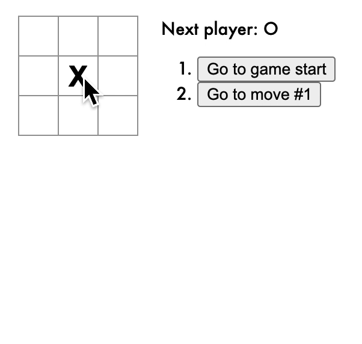
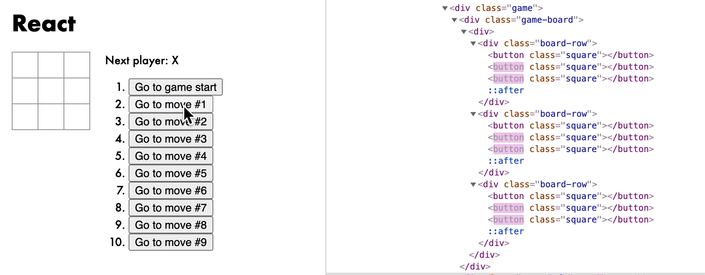
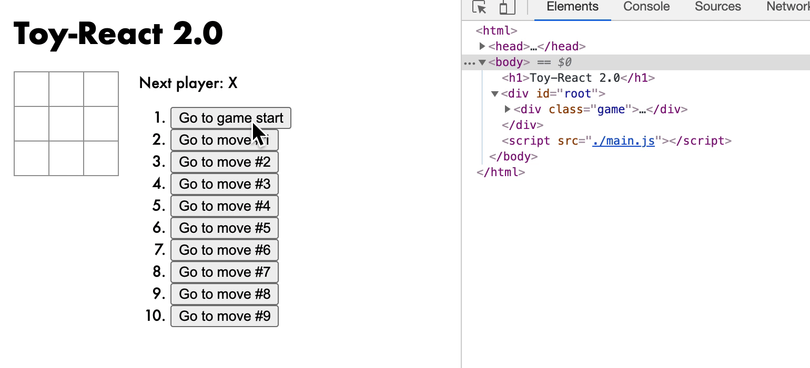
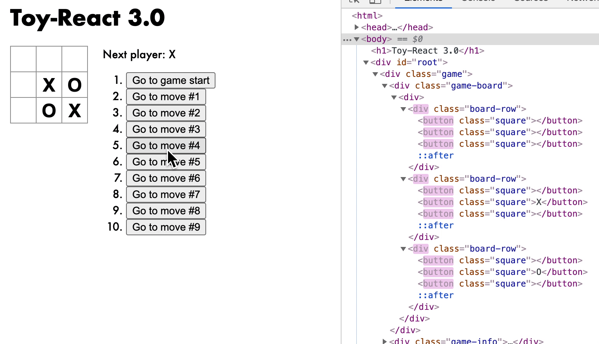

# Toy-React 简易版React框架搭建

本文为个人学习笔记。

## 准备工作

* [Node.js](https://nodejs.org/en/)
* [Webpack](https://webpack.js.org/)
* [React Tutorial](https://reactjs.org/tutorial/tutorial.html)
* [TicTacToe](https://codepen.io/gaearon/pen/gWWZgR)

最终目标：搭建简易版Toy-React环境，使React Tutorial中的TicTacToe的小游戏（下图）能够在我们的框架上运行。



## 配置环境

* 新建文件夹`Toy-React`，打开命令行进入到该文件夹，使用`npm init`初始化npm环境；
* 安装webpack：`npm --save-dev install webpack webpack-cli` ；
* 新建`main.js`文件，并写入以下测试代码：

```javascript
// 测试Babel是否能转换新特性
for(let i of [1,2,3]){
    console.log(i)
}
// 测试Babel是否能转换JSX代码
let div = <div></div>
```

* 安装babel：`npm install --save-dev babel-loader @babel/core @babel/preset-env `；
* 安装JSX的plugin：`npm install --save-dev @babel/plugin-transform-react-jsx`；
* 编写webpack配置文件，新建`webpack.config.js`文件，并写入以下代码：

```javascript
module.exports= {
    // entry 为打包文件入口
    entry: {
        main: './main.js'
    },
    // 设置为开发模式，使build出来的文件方便调试
    mode: "development",
    optimization: {
        minimize: false
    },
    // 配置babel-loader
    module: {
        rules: [
            {
                test: /\.js$/,
                use: {
                    loader: 'babel-loader',
                    options: {
                        presets: ['@babel/preset-env'],
                        plugins: [['@babel/plugin-transform-react-jsx',{pragma:'createElement'}]] // 设置babel的JSX插件
                    }
                }
            }
        ]
    }   
}
```

* 运行webpack编译：`npx webpack`；
* 在`dist/main.js`文件中可以看到编译完成的代码，其中包含以下代码，可以发现Babel以及webpack配置成功：

```javascript
for (var _i = 0, _arr = [1, 2, 3]; _i < _arr.length; _i++) {
  var i = _arr[_i];
  console.log(i);
}

var div = createElement("div", null);
```

（注：在`webpack.config.js`文件的`plugins: [['@babel/plugin-transform-react-jsx',{pragma:'createElement'}]]`中，`pragma`设置JSX编译后的展示方式。如果没有设置，`let div=<div></div>`经过编译后为`var div = React.createElement("div", null);`。为了和实际React区分开，把`React.createElement`替换为`createElement`，之后完善`createElement`函数即可）

至此，配置环境工作已经完成。

## 0.1版本-初识JSX

从上步可以得知，JSX形式代码会被Babel转换成`createElement`函数处理。根据React官方给出的[资料](https://reactjs.org/docs/react-api.html#createelement)，`createElement`接受三种参数`createElement(type,[props],[...children])`，分别对应Element的类型（可以是TagName或者自己定义的Class Component/Functional Component）、Element的属性、Element中包含的children。

例如：

```javascript
let div = (
    <div style='width:100px'>
        <h1>Hello</h1>
        <div></div>
        <div></div>
    </div>
);
```

经过编译后得到：

```javascript
var div = createElement(
    "div", 
    {style: "width:100px"}, 
    createElement("h1", null, "Hello"), 
    createElement("div", null), 
    createElement("div", null)
);
```

因此，可以写出`createElement()`的0.1版本：

```javascript
function createElement(tagName, attributes, ...children){
    let e = document.createElement(tagName); // 创建节点
	// 设置属性
    for (let a in attributes){ 
        e.setAttribute(a, attributes[a])
    }
	// 添加子节点
    for (let child of children) {
        if (typeof child === 'string') { // 文本节点
            child = document.createTextNode(child)
        }
        e.appendChild(child)
    }
    return e;
}
```

当然，上述版本还是有很多缺点的，比如：只能处理HTML原生标签，无法处理Event等等。

## 1.0版本-完善JSX解析

为了支持自定义Component，我们需要观察自定义Component的生成方式：

```javascript
let myComponent = <MyComponent></MyComponent>
```

经过编译后得到：

```javascript
var myComponent = createElement(MyComponent, null);
```

注意：这里`MyComponent`没有加引号，是变量直接传入，而不是字符串传入。小写字母开头的Tag默认为原生Tag，大写字母开头则为自定义Component。

（注：新版本React支持Class Component和Function Component，因此`MyComponent`可能是`class`或者是`function`。为了简单，在本文中所有自定义Component均为Class Component。）

为了将原生HTML Element和自定义Class Component的统一，我们需要对原生HTML Element和Text Node添加Wrapper，使所有元素拥有统一的调用方法。

* 新建`toy-react.js`文件，并写入以下代码：

```javascript
// ElementWrapper用来包装原生HTML Element，其DOM对象被保存在this.root下，设置属性或者添加子元素都对this.root进行操作
class ElementWrapper {
    constructor(type) {
        this.root = document.createElement(type)
    }
    setAttribute(name, value) {
        this.root.setAttribute(name, value)
    }
    appendChild(component) {
        this.root.appendChild(component.root)
    }
}

// TextWrapper用来包装原生文本节点，其DOM对象保存在this.root下
class TextWrapper {
    constructor(content) {
        this.root = document.createTextNode(content)
    }
}

// Component为所有自定义元素的父类，该类中需要存放属性this.props，子元素this.children，以及对应的DOM对象this._root
export class Component {
    constructor() {
        this.props = Object.create(null);
        this.children = [];
        this._root = null;
    }
    setAttribute(name, value) {
        this.props[name] = value;
    }
    appendChild(component) {
        this.children.push(component);
    }
    // 对外调用Component对应的DOM元素时，使用getter调用root，如果this._root为空，则调用this.render().root。注意：每个自定义Component都会有render()函数，其返回值为一个Component，如果此Component还不是原生HTML Element，则会进行递归调用。因此，最后的返回结果一定是只包含原生HTML Element的DOM对象
    get root() {
        if(!this._root) {
            this._root = this.render().root;
        }
        return this._root;
    }
}

export function createElement(type, attributes, ...children){
    let e;
    if (typeof type === 'string') { // 如果type是字符串，则表示原生HTML Element
        e = new ElementWrapper(type);
    } else {
        e = new type; // 否则为自定义Component，使用new来创建
    }
	
    // 设置属性
    for (let a in attributes){
        e.setAttribute(a, attributes[a])
    }

    // 插入children元素，如果children中有数组，则进行递归调用
    let insertChildren = (children) => {
        for (let child of children) {
            if (typeof child === 'string') {
                child = new TextWrapper(child) // 文本节点
            }
            if ((typeof child === 'object') && (child instanceof Array)) {
                insertChildren(child) // 如果child还是数组，则进行递归调用
            } else {
                e.appendChild(child) // 否则插入child
            }
            
        }
    }
    insertChildren(children)
    return e;
}

// 最外层render函数，需手动调用
export function render(component, parentElement) {
    parentElement.appendChild(component.root)
}
```

* 在`main.js`中写入以下代码：

```javascript
// 导入上述相关函数
import { createElement, Component, render } from './toy-react.js';

// 自定义Component，这里继承的是我们自己写的Component类
class MyComponent extends Component {
    render() {
        return (
            <div>
                <h1>my component</h1>
                {this.children}
            </div>
        );
    }
}

let App = (
    <MyComponent id='a' class='c'>
        <div id='testID'>abc</div>
        <div></div>
        <div></div>
    </MyComponent>
);

console.log(App.root); // 获取根节点DOM树

render(App, document.body); // 把根节点render到body上
```

* 使用`npx webpack`编译后，需要在`dist`文件夹中新建`index.html`，并链接到`main.js`：

```html
<body></body>
<script src="./main.js"></script>
```

* 用浏览器打开`index.html`，可以发现所有元素被正确渲染；控制台输出为：

```html
<div>
	<h1>my component</h1>
    <div id="testID">abc</div>
    <div></div>
    <div></div>
</div>
```

至此，我们已经能够处理基本的JSX代码了，包括原生HTML Element和自定义Component，并且能够成功将Element渲染出来。

## 2.0版本-添加生命周期render

到目前为止，我们虽然能够将Element渲染出来，但是没有更新页面的能力，也没法处理Event事件。因此，在2.0版本中，我们要完成以下功能：

* 添加State保存Component状态；

* 当State发生改变时，能够在页面上某个位置渲染某个元素。这里主要使用[Range API](https://developer.mozilla.org/en-US/docs/Web/API/Range)；
* 对Element的属性进行判断，如果为Event事件则需要对DOM元素添加监听；

[Range API](https://developer.mozilla.org/en-US/docs/Web/API/Range) 简要介绍：

* Range是页面document中的一小部分，包含了页面上的部分节点，可以通过设置其范围来插入或删除节点；
* `document.createRange()`：创建一个range对象；
* `Range.setStart()`、`Range.setEnd()`：设置range的起始位置和结束位置；
* `Range.deleteContents()`：删除range中所有元素；
* `Range.insertNode()`：在range起始位置添加节点；
* ......

`toy-react.js`完整代码如下：

```javascript
const RENDER_TO_DOM = Symbol('render to dom'); // 设置一个Symbol，作为Element的render方法，从外部无法调用

class ElementWrapper {
    constructor(type) {
        this.root = document.createElement(type);
    }
    setAttribute(name, value) {
        if (name.match(/^on([\s\S]+)$/)) {
            // 如果是on开头的Event事件，需要在this.root中添加对应的监听
            // 同时，要把首字母改为小写
            // onClick --> click
            this.root.addEventListener(
                RegExp.$1.replace(/^[\s\S]/, (c) => c.toLowerCase()),
                value
            );
        } else {
            if (name === 'className') {
                // className的情况需要特殊处理
                this.root.setAttribute('class', value);
            } else {
                this.root.setAttribute(name, value);
            }
        }
    }
    appendChild(component) {
        // 在当前元素的所有子元素最后添加新的Component
        let range = document.createRange();
        range.setStart(this.root, this.root.childNodes.length);
        range.setEnd(this.root, this.root.childNodes.length);
        // 确定range位置后，调用component的render方法
        component[RENDER_TO_DOM](range);
    }
    [RENDER_TO_DOM](range) {
        // 在给定range位置中渲染元素：先将之前的内容删除，再插入新的元素
        range.deleteContents();
        range.insertNode(this.root);
    }
}

class TextWrapper {
    constructor(content) {
        this.root = document.createTextNode(content);
    }
    [RENDER_TO_DOM](range) {
        range.deleteContents();
        range.insertNode(this.root);
    }
}

export class Component {
    constructor() {
        this.props = Object.create(null);
        this.children = [];
        this._root = null;
        this._range = null;
    }
    setAttribute(name, value) {
        this.props[name] = value;
    }
    appendChild(component) {
        this.children.push(component);
    }
    [RENDER_TO_DOM](range) {
        this._range = range;
        // this.render()最终会返回原生DOM对象，调用此DOM对象的render方法
        this.render()[RENDER_TO_DOM](range);
    }
    // 当State发生改变时，需重新渲染
    rerender() {
        // 保存旧Range
        let oldRange = this._range;
        // 在旧Range前面重新插入元素
        let range = document.createRange();
        range.setStart(oldRange.startContainer, oldRange.startOffset);
        range.setEnd(oldRange.startContainer, oldRange.startOffset);
        this[RENDER_TO_DOM](range);
		// 删除旧Range的内容
        oldRange.setStart(range.endContainer, range.endOffset);
        oldRange.deleteContents();
    }
    // 设置新State
    setState(newState) {
        if (this.state === null || typeof this.state !== 'object') {
            // 如果state为空，直接覆盖并重新渲染
            this.state = newState;
            this.rerender();
            return;
        }
        // 否则，合并新旧State，并重新渲染
        let merge = (oldState, newState) => {
            for (let p in newState) {
                if (oldState[p] === null || typeof oldState[p] !== 'object') {
                    oldState[p] = newState[p];
                } else {
                    merge(oldState[p], newState[p]);
                }
            }
        };
        merge(this.state, newState);
        this.rerender();
    }
}

export function createElement(type, attributes, ...children) {
    let e;
    if (typeof type === 'string') {
        e = new ElementWrapper(type);
    } else {
        e = new type();
    }

    for (let a in attributes) {
        e.setAttribute(a, attributes[a]);
    }

    let insertChildren = (children) => {
        for (let child of children) {
            if (typeof child === 'string') {
                child = new TextWrapper(child);
            }
            if (child === null) {
                continue;
            }
            if (typeof child === 'object' && child instanceof Array) {
                insertChildren(child);
            } else {
                e.appendChild(child);
            }
        }
    };
    insertChildren(children);

    return e;
}

export function render(component, parentElement) {
    // 删除旧元素，渲染新元素
    let range = document.createRange();
    range.setStart(parentElement, 0);
    range.setEnd(parentElement, parentElement.childNodes.length);
    range.deleteContents();
    component[RENDER_TO_DOM](range);
}
```

现在，我们可以试试React官网提供的TicTacToe的小游戏能否在Toy-React的框架下运行了。找到官网提供的[源码](https://codepen.io/gaearon/pen/gWWZgR)。把CSS代码和HTML中的`<div id="root"></div>`拷贝到`index.html`下，并且把所有的JS代码拷贝到`main.js`下。

注意：需要在`main.js`中引入我们自己的Toy-React框架：`import { createElement, Component, render } from './toy-react'`，并且把`React.Component`改为`Component`，把`ReactDOM.render`改为`render`，并且把官方的Function Component改为Class Component。


至此，TicTacToe小游戏已经可以正常运行。相比于上一版本，目前的Toy-React已经可以处理Event事件，存储State，以及重新渲染页面了。可以说，利用目前的Toy-React框架已经可以编写很多应用了。

## 3.0版本- Virtual DOM渲染优化

要说React框架的一大优点，就是利用了Virtual DOM的对比，选择性渲染部分Component。当某个子元素没有发生改变时，React不会重新渲染该元素，大大提高了性能。

对比以下两幅图，可以发现React框架在渲染时只会把有变化的元素重新渲染（右侧闪红的部分`button`），而我们的Toy-React 2.0版本则不论什么情况都重新渲染整个`root`节点（右侧闪红的整个`div`）。	





在实际React框架中，[DIFF算法](https://reactjs.org/docs/reconciliation.html)的简要规则如下：

* 如果两节点type不同，则销毁旧节点（包括其子节点），重新构造新节点；
* 如果两节点type相同，则比较两节点属性，若某属性不同，对属性进行更改；
* 如果两节点相同，比较两者的子节点；通过`key`关键字判断对应子节点是否应为同一节点；

在Toy-React中，我们采取较为简单的Virtual DOM对比方式：

* 如果两节点type不同，则新节点替换旧节点；（和React相同）
* 如果两节点type相同，但节点某属性不同，或属性数量不同，则新节点替换旧节点；（和React不同）
* 如果两文本节点内容不同，则新节点替换旧节点；（和React不同）
* 如果以上都不满足，则两节点相同，按照相同规则一一比较两节点下的所有子节点；（和React不同）

`toy-react.js` 此时代码如下：

```javascript
const RENDER_TO_DOM = Symbol('render to dom');

export class Component {
    constructor() {
        this.props = Object.create(null);
        this.children = [];
        this._root = null;
        this._range = null;
    }
    setAttribute(name, value) {
        this.props[name] = value;
    }
    appendChild(component) {
        this.children.push(component);
    }
    [RENDER_TO_DOM](range) {
        this._range = range;
        // this.vdom 为更新后
        // this._vdom 为更新前
        this._vdom = this.vdom;
        this._vdom[RENDER_TO_DOM](range);
    }
    get vdom() {
        return this.render().vdom;
    }
    update() {
        let isSameNode = (oldNode, newNode) => {
            // 如果两节点type不同，直接返回false
            if (oldNode.type !== newNode.type) {
                return false;
            }
            // 如果两节点某prop不同，直接返回false
            for (let p in newNode.props) {
                if (newNode.props[p] !== oldNode.props[p]) {
                    return false;
                }
            }
            // 如果两节点prop数量不同，直接返回false
            if (
                Object.keys(oldNode.props).length >
                Object.keys(newNode.props).length
            ) {
                return false;
            }
            // 如果两文本节点内容不同，直接返回false
            if (newNode.type === '#text') {
                if (newNode.content !== oldNode.content) {
                    return false;
                }
            }
            return true;
        };
        let update = (oldNode, newNode) => {
            // 如果新旧节点不同，则直接在旧节点的位置渲染新节点
            if (!isSameNode(oldNode, newNode)) {
                newNode[RENDER_TO_DOM](oldNode._range);
                return;
            }
            newNode._range = oldNode._range;

            let newChildren = newNode.vchildren;
            let oldChildren = oldNode.vchildren;

            if (!newChildren || !newChildren.length) {
                return;
            }

            let tailRange = oldChildren[oldChildren.length - 1]._range;
			
            // 对比新旧节点的子节点
            for (let i = 0; i < newChildren.length; i++) {
                let newChild = newChildren[i];
                let oldChild = oldChildren[i];
                if (i < oldChildren.length) {
                    update(oldChild, newChild);
                } else {
                    // 新节点的子节点比较多，直接在后面渲染新的子节点
                    let range = document.createRange();
                    range.setStart(tailRange.endContainer, tailRange.endOffset);
                    range.setEnd(tailRange.endContainer, tailRange.endOffset);
                    newChild[RENDER_TO_DOM](range);
                    tailRange = range;
                }
            }
        };
        let vdom = this.vdom;
        // 对比新旧vdom，并更新
        update(this._vdom, vdom);
        this._vdom = vdom;
    }

    setState(newState) {
        if (this.state === null || typeof this.state !== 'object') {
            this.state = newState;
            this.update();
            return;
        }
        let merge = (oldState, newState) => {
            for (let p in newState) {
                if (oldState[p] === null || typeof oldState[p] !== 'object') {
                    oldState[p] = newState[p];
                } else {
                    merge(oldState[p], newState[p]);
                }
            }
        };
        merge(this.state, newState);
        this.update();
    }
}

// 在range处插入node，先插入再删除
function replaceContent(range, node) {
    range.insertNode(node);
    range.setStartAfter(node);
    range.deleteContents();

    range.setStartBefore(node);
    range.setEndAfter(node);
}

class ElementWrapper extends Component {
    constructor(type) {
        super(type);
        this.type = type;
    }

    get vdom() {
        // 获取所有子节点的vdom
        this.vchildren = this.children.map((child) => child.vdom);
        return this;
    }

    [RENDER_TO_DOM](range) {
        this._range = range;

        let root = document.createElement(this.type);
        
        // 设置属性
        for (let name in this.props) {
            let value = this.props[name];
            if (name.match(/^on([\s\S]+)$/)) {
                root.addEventListener(
                    RegExp.$1.replace(/^[\s\S]/, (c) => c.toLowerCase()),
                    value
                );
            } else {
                if (name === 'className') {
                    root.setAttribute('class', value);
                } else {
                    root.setAttribute(name, value);
                }
            }
        }

        if (!this.vchildren) {
            this.vchildren = this.children.map((child) => child.vdom);
        }
		
        // 更新子节点
        for (let child of this.vchildren) {
            let childRange = document.createRange();
            childRange.setStart(root, root.childNodes.length);
            childRange.setEnd(root, root.childNodes.length);
            child[RENDER_TO_DOM](childRange);
        }
        replaceContent(range, root);
    }
}

class TextWrapper extends Component {
    constructor(content) {
        super(content);
        this.type = '#text';
        this.content = content;
    }
    get vdom() {
        return this;
    }

    [RENDER_TO_DOM](range) {
        this._range = range;
        let root = document.createTextNode(this.content);
        replaceContent(range, root);
    }
}

export function createElement(type, attributes, ...children) {
    let e;
    if (typeof type === 'string') {
        e = new ElementWrapper(type);
    } else {
        e = new type();
    }

    for (let a in attributes) {
        e.setAttribute(a, attributes[a]);
    }

    let insertChildren = (children) => {
        for (let child of children) {
            if (typeof child === 'string') {
                child = new TextWrapper(child);
            }
            if (child === null) {
                continue;
            }
            if (typeof child === 'object' && child instanceof Array) {
                insertChildren(child);
            } else {
                e.appendChild(child);
            }
        }
    };
    insertChildren(children);

    return e;
}

export function render(component, parentElement) {
    let range = document.createRange();
    range.setStart(parentElement, 0);
    range.setEnd(parentElement, parentElement.childNodes.length);
    range.deleteContents();
    component[RENDER_TO_DOM](range);
}

```

到目前为止，我们的Toy-React框架已经有了对比Virtual DOM的能力（虽然很简单）。

我们再来看看Toy-React 3.0版本的元素更新情况：从下图可以看出，3.0版本已经比2.0版本有所进步了，在更新时不会重新渲染整个`root`节点，而是只更新棋盘中的（所有）`button`。但是和实际React还是有所区别，主要原因在于我们没有对相同的子节点使用`key`关键词区别。



## 写在最后

本文实现了一个简易版React框架，包括部分核心功能，如：JSX解析；支持自定义Component；支持Event事件；具备重新渲染页面的能力；添加Virtual DOM对比提升性能等等。

当然，和实际React框架仍有很大区别，例如：

* `createElement()`中仅支持Class Component，不支持Function Component；
* 不支持部分生命周期函数，如`componentDidMount()`等等；
* 不支持Function Component中使用的Hooks，如`useState()`等等；
* Virtual DOM对比方式更简单；
* ......

> 本文为个人学习笔记，因为个人能力所限，如有错误，欢迎指出。


